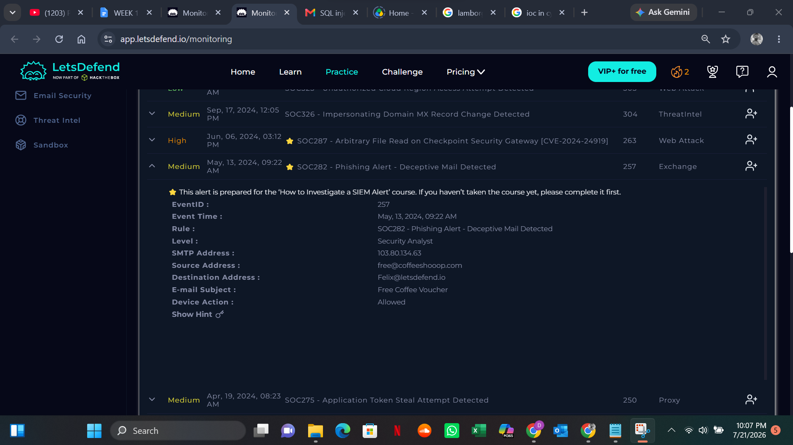
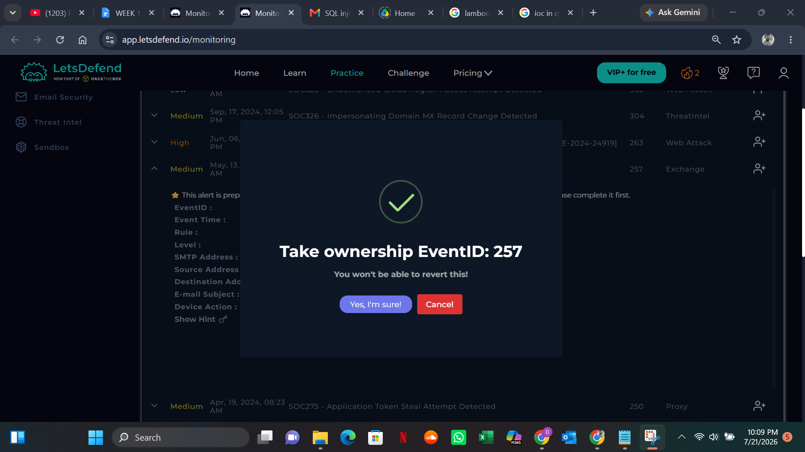
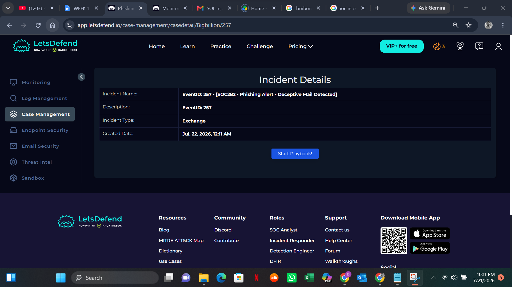
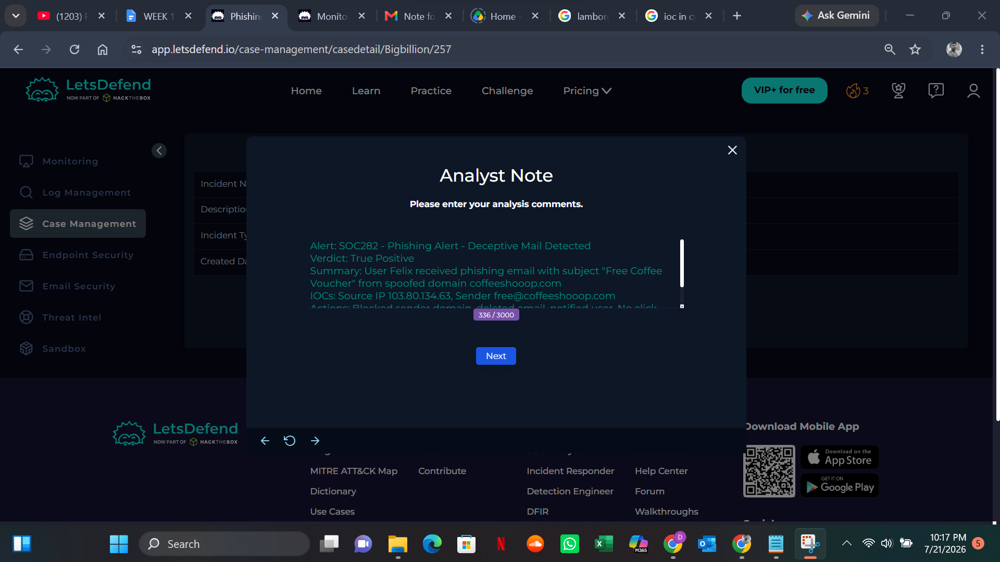
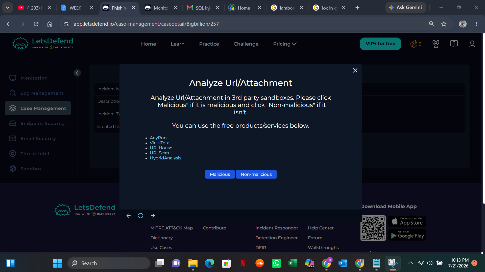
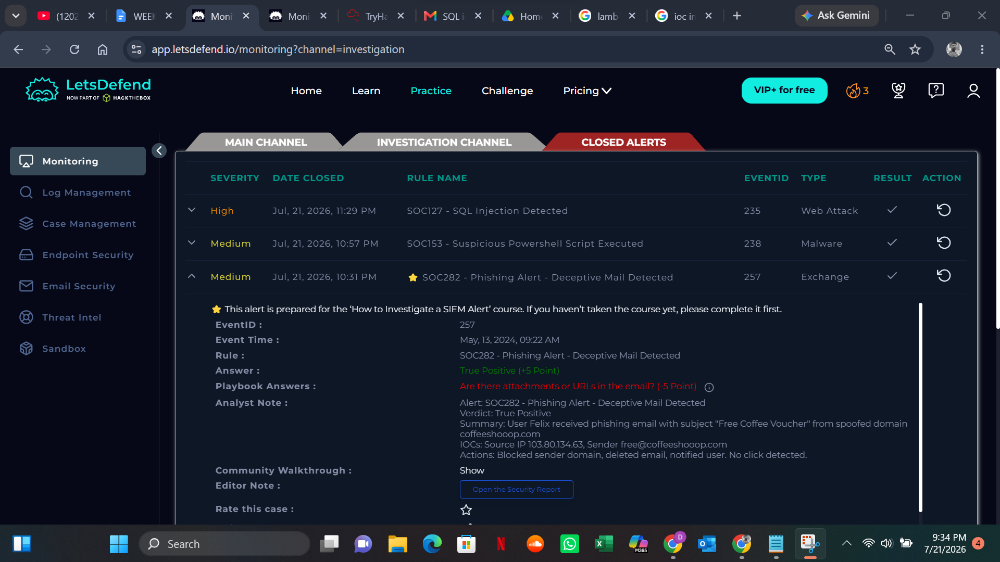

# SOC282 - Phishing Email Detected

**Date**: 2026-04-27  
**Platform**: Let'sDefend SOC Simulator  
**Severity**: Medium  
**Verdict**: True Positive ✅

## 1. Alert Summary
User received a phishing email with malicious link impersonating Microsoft 365 login page.

## 2. IOCs
| Type | Value |
| --- | --- |
| Sender | `fake-microsoft@secure-login.com` |
| Subject | `Urgent: Password Reset Required` |
| URL | `http://microsooft-login.net` |

## 3. Actions Taken
1. Deleted email from user mailbox
2. Blocked sender domain in email gateway
3. Notified user about phishing and password reset

## 4. MITRE ATT&CK
**T1566.002 - Phishing: Spearphishing Link**

Big Billion <davidogun100@gmail.com>
8:57 PM (0 minutes ago)
to davidadeniyi1995, savenet419

## 5. Evidence

*Figure 1: Phishing email alert from Let'sDefend*

*Figure 2: Alert ownership and assignment*

*Figure 3: Email header analysis*

*Figure 4: IOC analysis*

*Figure 5: Triage steps*

*Figure 6: Ticket closure and resolution*
