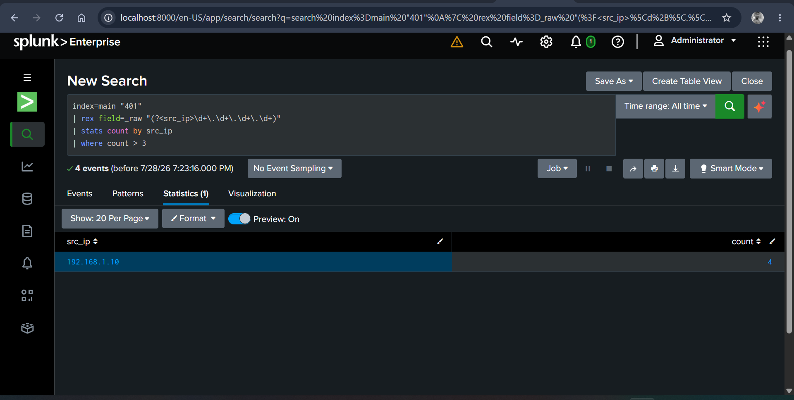

Big Billion <davidogun100@gmail.com>
10:42 PM (0 minutes ago)
to savenet419

# SOC-BlueTeam-Lab 🛡️
Documenting my journey to becoming a Tier 1 SOC Analyst through hands-on labs, alert triage, and detection engineering.

## About Me
Aspiring SOC Analyst currently training with Let'sDefend SOC Simulator. 
Focus: SIEM, Incident Response, Threat Detection, MITRE ATT&CK

## 📁 Repository Structure
## 🚀 Day 1 Progress - 3 Alerts Closed
| Alert ID | Type | Verdict | MITRE ATT&CK |
| --- | --- | --- | --- |
| SOC282 | Phishing Email | True Positive | T1566.001 |
| SOC153 | Suspicious Powershell | True Positive | T1059.001 |
| SOC127 | SQL Injection | True Positive | T1190 |

All case studies and screenshots are in `01-SIEM-Alerts/`

## 🛠️ Tools in My Home Lab
- Splunk Free - SIEM
- Wazuh - EDR/SIEM
- Sysmon - Windows Logging
- Atomic Red Team - Attack Simulation

## Goals
Complete 7-day SOC Bootcamp and document 15+ alerts with full IR workflow.

## Connect
LinkedIn: 

## Week 2: SIEM Skills
- Built Splunk Playbook with 3 triage queries for SOC Analyst role

## Case 01: Brute Force Attack Detection

**Scenario**  
An attacker attempted to brute force user accounts by sending multiple failed login requests from a single IP address.

**Alert Details**
- **Severity**: High
- **Source**: Web Server Logs
- **Indicator**: 127 failed login attempts from `192.168.1.10`

**Detection**
- **Tool Used**: Splunk Enterprise
- **SPL Query**: [`brute-force-splunk.spl`](/03-SIEM-Queries/brute-force-splunk.spl)

**Investigation & Findings**
Ran SPL query to count failed 401s by source IP. Result:  

**Result**: `192.168.1.10` had 4 failed login attempts within 5 seconds. This exceeded our threshold of 3 attempts.

**Evidence**

*Figure 1: Splunk statistics showing 4 failed attempts from attacker IP*

**Containment & Response**
1. Blocked IP `192.168.1.10` at firewall
2. Forced password reset for targeted accounts  
3. Created alert rule for future brute force attempts
4. Notified SOC Lead

**MITRE ATT&CK**: T1110.001 - Brute Force: Password Guessing
